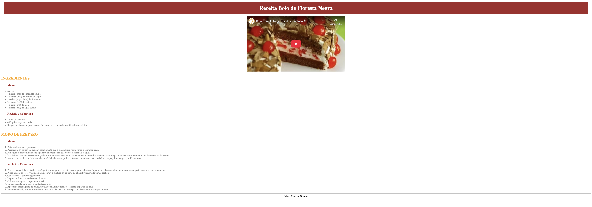

# 0-Receita 

Primeira atividade realizada, introdução a HTML e CSS por meio da ferramenta CodePen, desenvolvido nas aulas da disciplina Linguagem de Marcação do curso Desenvolvimentos de Sistemas no Senai

## Tecnologias utilizadas
* HTML
* CSS

## Autor

[Edvan Alves](https://br.linkedin.com/in/edvan-alves)
